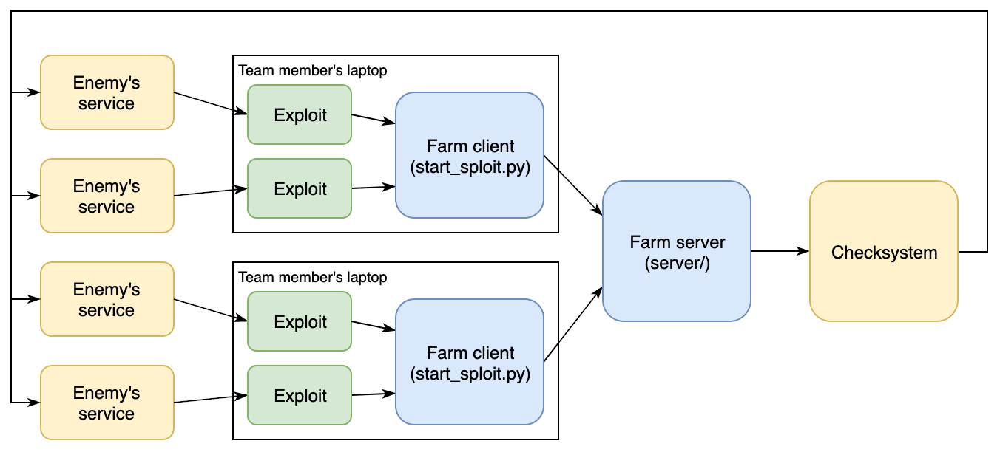

# A/D Exploit Infrastructure

## OpenAttackDefenseTools/ataka

[Ataka](https://github.com/OpenAttackDefenseTools/ataka.git) is an
exploit runner and flag submitter which allows running containerized
exploits from a single instance as well as accepting and deduplicating
flags from exploits running locally on participants' laptops.

In both cases, exploits are queued by the ataka service instance according
to the round time and user-defined constraints (useful e.g when the flag
submission has rate limits). This way, teams are able to:

- run exploits from laptops, which offloads computation
  from the central exploiter instance
- run exploits from a central instance, which prevents downtime
  due to laptops running out of battery or bad throughput from a slower
  connection to the game network

## DestructiveVoice/DestructiveFarm

[DestructiveFarm](https://github.com/DestructiveVoice/DestructiveFarm)
is a tool for managing and running exploits. It consists of three main components: **exploits**, **farm clients**
and a **farm server**.

The **exploits** are each given a victim host and use this to extract flags stdout.

The **farm client** periodically runs exploits on an arbitrary machine
and checks the output.

The **farm server** collects flags from the farm clients and submits them to
the game infrastructure.

This architecture enables running exploits independently from the central
instance where the farm server is hosted and flags are submitted.

## Running Locally

Obviously, it also always possible to just run exploits locally from
the player's laptop. This is often the best setup for initial testing
of the exploit. Running from a laptop can be quite risky though - you lose
both the points from attacking and the exploit script (temporarily) when a
laptop becomes unresponsive.
