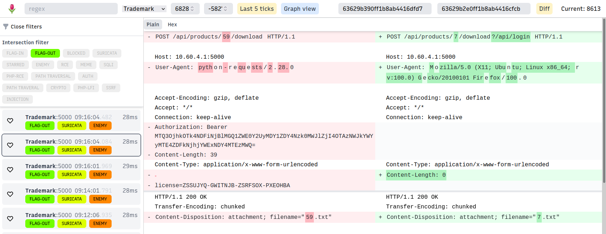
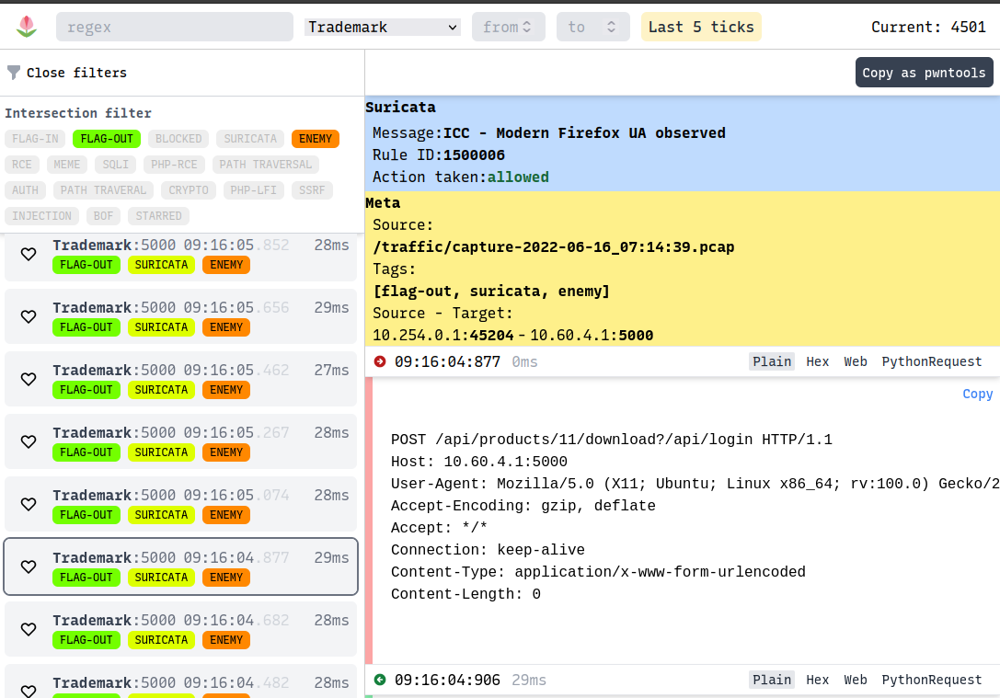
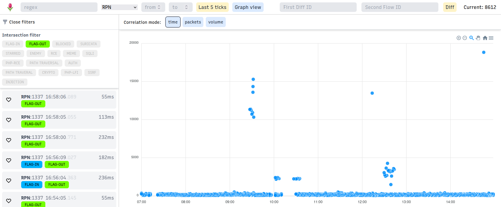

# A/D Traffic Monitoring

## OpenAttackDefenseTools/tulip

Tulip is a deep packet inspection (DPI) tool that allows inspecting and dissecting
network traffic (TCP in particular) from a user-friendly web interface.

It allows quickly searching packet contents using regex queries, decoding
it directly in the web interface, and tagging traffic according to custom filters.

..as well as ingesting Suricata logs for annotating flows with IPS metadata..

..and analyzing packet volume and service response times.

One of its defining features is the `Copy as Pwntools` functionality, which
generates a script that replicates the interactions of the selected TCP session.

## arkime/arkime

[Arkime](https://github.com/arkime/arkime) (formerly Moloch) is an [ElasticSearch](https://github.com/elastic/elasticsearch)-based network analysis tool with support for DPI on large-scale data.

The web interface is not as responsive or easy to use as Tulip's. For example,
searching for data in packets involves [starting a hunt](https://malcolm.fyi/docs/arkime.html#hunt),
which requires clicking through at least three different UI elements and
makes results available slower than other monitoring tools on similar queries.

The defining features of Arkime are its familiar tech stack and the ability to [mesh multiple instances](https://arkime.com/multihost), which allows scaling to larger network loads than other tools. Usually, this is not necessary, though, under typical A/D CTF loads.

## fox-it/pcap-broker

When playing on organizer-provided vulnboxes, which are often not provisioned
to run much else besides the services, it can make sense to send traffic
to an external VPS for processing instead.
[Pcap-broker](https://github.com/fox-it/pcap-broker) helps with this by
turning a `tcpdump` into a pub/sub server, which processing services can
connect to via TCP.

Under the hood, pcap-broker writes a valid PCAP header into each client
connection and then dumps the real-time traffic into it. This way, the
overhead to regular tcpdump is effectively zero.

To reduce the number of connections to the vulnbox, you can also chain
pcap-broker instances.

Both Tulip and Arkime have support for `PCAP_OVER_IP`.

