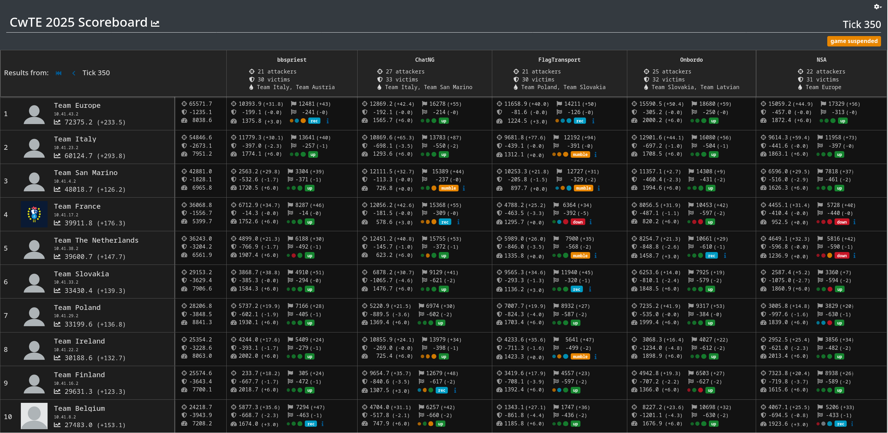

# Compete with Team Europe 2025

*Compete with Team Europe* is an annual event in which teams from the
[ECSC (European Cybersecurity Challenge)](https://ecsc.eu)
compete against [Team Europe](https://icc.ecsc.eu/teams) in Jeopardy and A/D-style
CTFs to prepare for upcoming competitions.

On the 14th of September 2025, [Attacking-Lab](/) hosted the A/D CTF for CwTE
2025 with community-contributed services to test infrastructure for
[ECSC 2025](ecsc2025.md).

## Infrastructure

Each team was provided a cloud-hosted vulnbox and their own cloud-hosted router
to connect to the game network through.

## Services

The following services were played:

- **[bbspriest](https://github.com/attacking-lab/cwte2025-service-bbspriest)**: A service in the style of a bulletin board system confession booth for CTF players.

- **[ChatNG](https://github.com/attacking-lab/cwte2025-service-chatng)**: A web chat application which can connect users with one of many chat bots.
- **[FlagTransport](https://github.com/attacking-lab/cwte2025-service-flagtransport)**: A service for managing logitics/tranportation of cargo, written in COBOL.
- **[Onbordo](https://github.com/attacking-lab/cwte2025-service-onbordo)**: A secure, encrypted file exchange for employees, very enterprise, much Java.
- **[NSA](https://github.com/attacking-lab/cwte2025-service-nsa)**: A secret database for NSA personnel to view private chats of american citizens.

## Scoreboard

{ .on-glb }

The [SaarCTF2024](/attack-defense/scoring/saarctf2024.md) scoring formula was used.

Also available at: [https://cwte2025ad.ecsc.eu](https://cwte2025ad.ecsc.eu)
