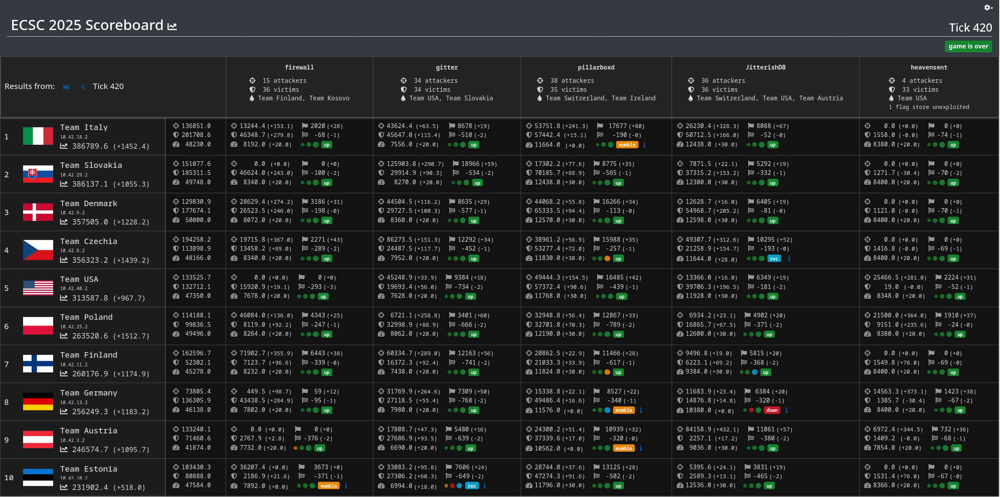

# European Cybersecurity Challenge 2025

*European Cybersecurity Challenge* is an annual event in which teams from the
across Europe, along with a few guest teams, compete in Jeopardy and A/D-style
CTFs for eternal glory in the [hall of fame](https://ecsc.eu/hall-of-fame).

[Attacking-Lab](/) was contracted by the [NASK PIB](https://www.nask.pl/)
to organize the ECSC 2025 A/D CTF, as well as for preparating 5 A/D
services, and hosting 3 public infrastructure demos leading up to the event.
The CTF took place on the 8th of October 2025.

## Infrastructure

The game was hosted completely in the cloud. To this end, the venue of the event,
COS Towar Arena, was directly peered with the Warsaw OVH Datacenter WAW1 for
optimal connectivity.

Each team was provided a cloud-hosted vulnbox and exploiter, as well as their
own cloud-hosted router to connect to the game network through.

## Services

The following services were played:

- **[firewall](https://github.com/attacking-lab/ecsc2025-service-firewall)**: An enterprise firewall via custom VPN, with an FTP and SNMP server behind it.
- **[gitter](https://github.com/attacking-lab/ecsc2025-service-gitter)**: A git management platform, inspired by Github, with a frontend and SSH access.
- **[pillarboxd](https://github.com/attacking-lab/ecsc2025-service-pillarboxd)**: A service for managing movie watchlists and sharing them them with friends.
- **[jitterish](https://github.com/attacking-lab/ecsc2025-service-jitterish)**: A database service with a web frontend, using a custom JIT query language.
- **[heavensent](https://github.com/attacking-lab/ecsc2025-service-heavensent)**: A service simulating a multi-user satellite system, written in Angelscript.

## Scoreboard

{ .on-glb }

The [ECSC2025](/attack-defense/scoring/ecsc2025.md) scoring formula was used.

Also available at: [https://scoreboard.ad.ecsc2025.pl](https://scoreboard.ad.ecsc2025.pl)
